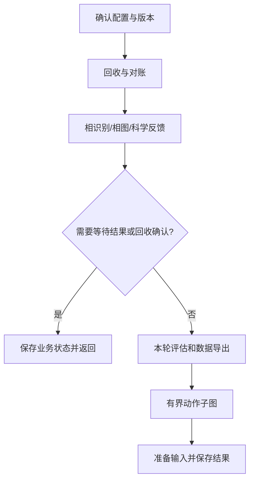
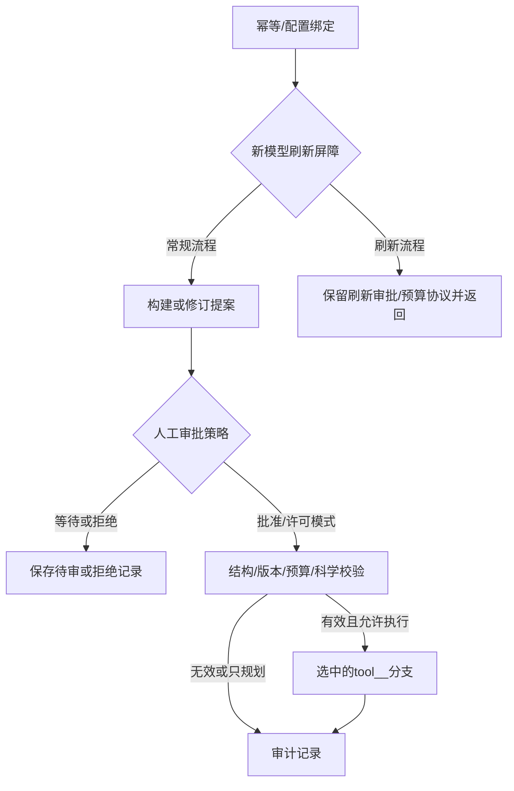

# LangGraph 编排职责

项目只有LangGraph一种Agent编排框架。Pydantic是数据校验库；科学函数、记忆、预算和台账不因更换框架重复实现。

四层图设计、完成范围与原生恢复实施顺序见[整体设计](LANGGRAPH_REDESIGN.md)。StateGraph构建只存在于orchestration，业务模块负责节点实现与依赖装配。

目录导航见 [orchestration/README.md](../orchestration/README.md)。生命周期与工具图定义集中在 orchestration 包；节点实现按业务职责保留，旧同名图包装已移除。

公开run/main.py仅装配依赖；初始化、回收分析、收尾和状态支持已拆为execution_layer/workflows/lifecycle_*.py，工具审计与结果合并见tool_outcomes.py。完整阅读顺序与未完成拆分见PROJECT_STRUCTURE.md。

## 生命周期图

入口run.main.run_workflow → search_workflow_graph。LLM下一步建议不得先于当前结果分析；等待分支不生成新任务。

## 动作与工具图

run_event_loop负责有界动作迭代与每步业务快照。
run_tool_step提供节点实现；tool_action_graph根据registry构建所有工具分支。
模型输出只是一份proposal，不能直接决定跳过审批、扩大预算、删除文件或提交任务。
execute_tool_action是既有科学handler的调用适配器，不再充当工作流编排器。
参数、失败处理和预算预留遵循原协议；新模型刷新使用原已批准的有界刷新策略。

## 决策与存储

原生审批恢复已接入独立approval_graph，使用SQLite checkpointer与interrupt/Command；科学工具不在该可恢复子图内。恢复范围和重复交付拦截见[NATIVE_APPROVAL_RECOVERY.md](NATIVE_APPROVAL_RECOVERY.md)。

langgraph_decision节点顺序为科学建议（包含既有一次修正）→ typed与科学一致性校验。不会额外请求一次模型用于“再决定”。
UI、配置确认和新运行工厂统一选择langgraph；没有另一套Agent框架或legacy决策旁路。

业务state/ledger、审批hash、版本和invocation_id仍是唯一持久事实来源。
生命周期与工具图的frame已移入WorkflowRuntime上下文，图状态只记录阶段、工具选择与返回结果。调用期上下文仍可能包含运行对象，不是可恢复检查点；禁止直接保存或让自动重试重放提交。
重启后从业务快照继续，以幂等键与待审记录恢复，而不是自动从上一次graph node继续。
运行对象移入Runtime context这一步已完成。要启用原生持久检查点，仍需明确各节点可恢复的业务状态、返回结果序列化约束，并为每个副作用建立事务/提交不确定状态协议；阶段标签本身不足以恢复运行。

隔离测试会验证图节点与条件边、审批停止、无效动作不执行、等待结果不做决策、分析先于建议、磁盘恢复和模型刷新；不以此宣称实际超算/API验收完成。
