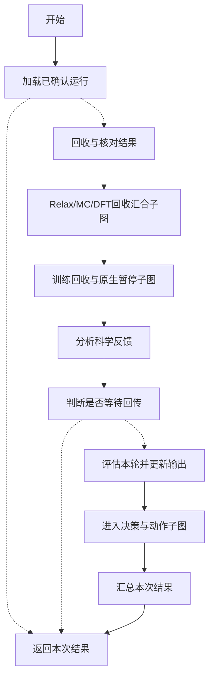
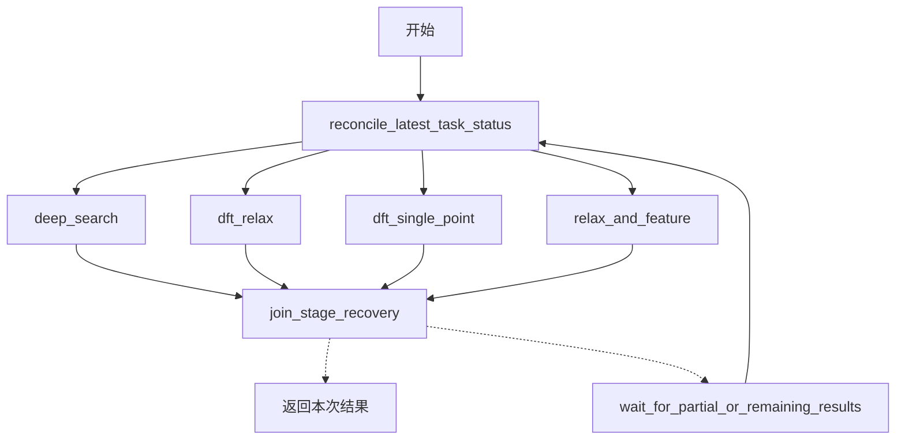
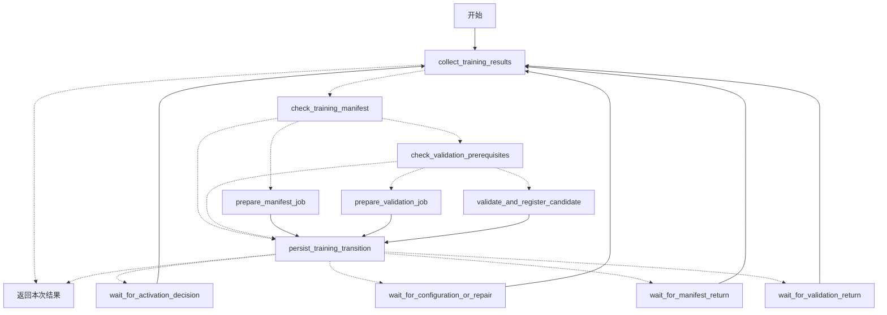
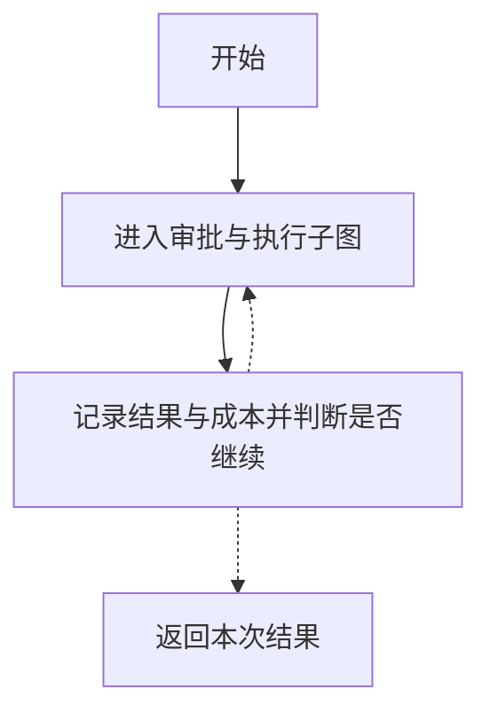
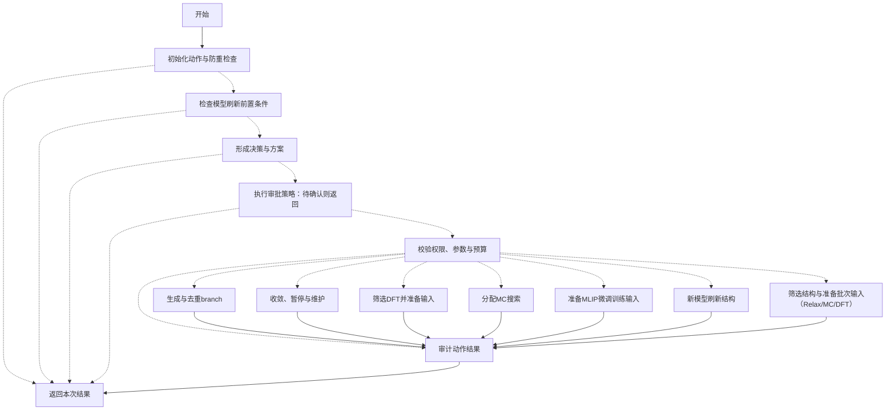

# 科学流程总览

本文件由 `python -m orchestration.graph_overview` 从真实编译图生成；仅用于阅读，不是第二套执行流程。实线为固定连线，虚线为条件路由，并非所有路径都会执行。

## 1. 本轮生命周期

## 计算阶段回收子图

各阶段并行检查已登记任务状态并汇合；部分回传暂停保存检查点，失败由现有审批重试入口处理。

## 训练回收与验证子图

等待节点使用原生interrupt，检查点保存在项目workflow_state/langgraph_training.sqlite；继续时携带最新业务状态重新核对。

## 2. 决策动作循环

## 3. 审批与动作执行

工具叶节点只在本说明图中合并。真实工具如下（每次只选一个，不是顺序流水线）：

- `adjust_strategy`
- `allocate_mc_bohb`
- `check_convergence`
- `generate_branches`
- `pause_search`
- `prepare_dedup_batch`
- `prepare_local_batch_files`
- `reevaluate_candidates`
- `restart_failed_task`
- `run_calculation_stage`
- `select_candidates`
- `select_dft_candidates`
- `update_mlip`

## Studio 阅读方式

聊天入口为 `phase_chat`。查看子图时按以下路径逐层定位；不同 Studio 版本的展开控件可能不同：

1. `confirmed_local_chat` → `scientific_lifecycle`：回收、分析、等待和评估。
训练交接：`training_lifecycle` → `training_lifecycle`，展开检查、准备、验证与等待节点。
2. `bounded_action_graph` → `bounded_action_iteration`：动作循环与持久化。
3. `execute_validated_action` → `approved_scientific_action`：提案、审批、校验及具体工具。

本总览不会替换 Studio 画布。实际审批与执行规则未修改；交互模式批准后通常只准备超算输入，由用户提交，再回传结果。等待、拒绝和失败均可能提前返回。
